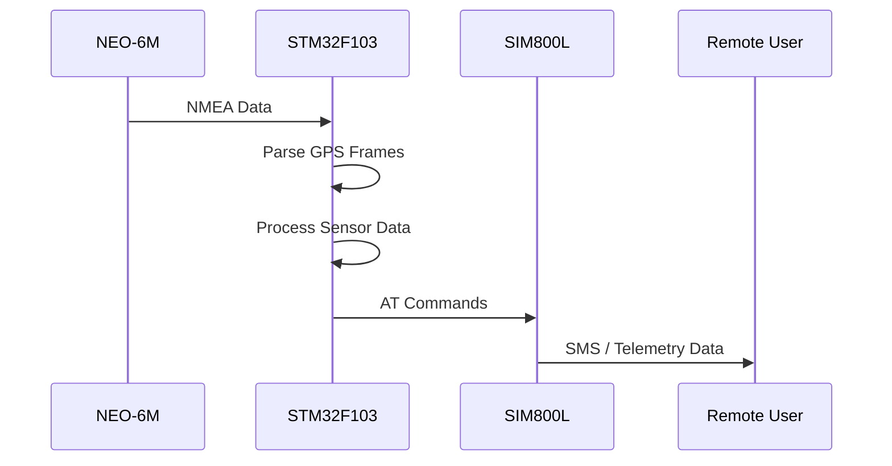

# STM32 RTOS-Based GPS/GSM Telemetry System

A lightweight bare-metal / RTOS-ready telemetry platform based on the STM32F103 series.

This project is designed for remote monitoring and telemetry applications using:

- GSM/GPRS communication via SIM800L
- GPS location and UTC time extraction via NEO-6M
- Environmental and system monitoring
- USART + DMA communication pipelines
- Modular peripheral APIs for embedded development

The current implementation focuses on:

- Low-level driver validation
- Communication stability
- Hardware integration testing
- Embedded firmware architecture

---

# System Architecture

```mermaid
flowchart TD

    A[Application Layer]
    A1[Telemetry]
    A2[Sensor Monitor]
    A3[GPS Parser]
    A4[SMS Handler]

    B[Service Layer]
    B1[Logging]
    B2[NMEA Parser]
    B3[Command Handler]
    B4[DMA Services]

    C[Driver/API Layer]
    C1[GPIO]
    C2[USART]
    C3[ADC]
    C4[DMA]
    C5[TIM]
    C6[NVIC]
    C7[RCC]

    D[Hardware Abstraction]
    D1[CMSIS]
    D2[STM32 Registers]
    D3[Startup Code]

    A --> B
    B --> C
    C --> D

    A --> A1
    A --> A2
    A --> A3
    A --> A4

    B --> B1
    B --> B2
    B --> B3
    B --> B4

    C --> C1
    C --> C2
    C --> C3
    C --> C4
    C --> C5
    C --> C6
    C --> C7

    D --> D1
    D --> D2
    D --> D3
````

---

# Features

* Bare-metal STM32F103 firmware
* RTOS-ready software architecture
* USART logging subsystem (`printf()` redirection)
* SIM800L SMS communication support
* NEO-6M GPS integration using NMEA protocol
* ADC internal temperature monitoring
* Analog Watchdog (AWD) support
* DMA-based USART communication
* Modular peripheral abstraction layer
* Debug and Release build configurations via CMake

---

# Supported Hardware

## Microcontroller

* STM32F103C8T6
* Blue Pill and compatible boards

## GSM Module

* SIM800L

## GPS Module

* NEO-6M
* NMEA protocol supported

---

# Hardware Requirements

> [!WARNING]
> Before powering the system, verify all voltage levels, power rails, and UART connections carefully.

Incorrect wiring or unstable power supplies may cause:

* Hard faults
* UART communication failures
* Sensor malfunction
* Permanent hardware damage

## SIM800L Power Notes

SIM800L requires a stable external power source due to high current peaks during GSM transmission.

Recommended:

* Dedicated power regulator
* Low-ESR capacitors near the module
* Proper grounding
* Separate power rail from MCU when possible

---

# Hardware Connection Diagram

```mermaid
flowchart LR

    STM32[STM32F103 Blue Pill]

    GPS[NEO-6M GPS Module]
    GSM[SIM800L GSM Module]
    PC[USB UART Debug Terminal]

    GPS -- USART1 RX/TX --> STM32

    STM32 -- USART2 TX/RX --> PC

    STM32 -- USART3 TX/RX --> GSM

    POWER[External Power Supply]

    POWER --> GSM
    POWER --> STM32
    POWER --> GPS
```

---

# Firmware Data Flow



---

# Software Stack

## Application Layer

High-level telemetry and monitoring logic:

* GPS processing
* SMS communication
* Sensor monitoring
* Telemetry reporting

## Service Layer

Reusable middleware services:

* Logging subsystem
* NMEA parser
* Command processing
* DMA data handling

## Driver/API Layer

Low-level peripheral drivers:

* GPIO
* USART
* ADC
* DMA
* TIM
* NVIC
* RCC

## Hardware Abstraction

Direct CMSIS/register-level access for STM32F103 devices.

---

# Build Configuration

The project supports multiple build configurations using CMake.

## Debug Build

Debug mode enables:

* USART2 logging output
* `printf()` debugging support
* DMA testing utilities
* Internal temperature monitoring utilities

Useful for:

* Hardware bring-up
* Peripheral debugging
* DMA validation
* Sensor verification

## Release Build

Release mode:

* Disables debug logging
* Removes unnecessary debug overhead
* Optimizes firmware size
* Improves execution efficiency

---

# Compile-Time Feature Flags

```cmake
option(MONITOR_INTERNAL_TEMP "Enable internal temperature monitoring" ON)

option(TEST_DMA "Enable DMA testing utilities" OFF)
```

---

# Project Structure

```text
project/
├── Core/
│   ├── Inc/
│   └── Src/
│
├── Drivers/
│   ├── GPIO/
│   ├── USART/
│   ├── DMA/
│   ├── ADC/
│   └── RCC/
│
├── Services/
│   ├── Logging/
│   ├── NMEA/
│   └── Command/
│
├── Application/
│   ├── GPS/
│   ├── GSM/
│   └── Telemetry/
│
├── cmake/
├── CMakeLists.txt
└── README.md
```

---

# Development Goals

* Build a reusable embedded telemetry framework
* Improve low-level STM32 driver development skills
* Validate DMA-based communication pipelines
* Create a scalable RTOS-ready architecture
* Develop reliable GSM/GPS communication systems

---

# Future Improvements

* FreeRTOS integration
* TCP/IP over GPRS
* MQTT telemetry support
* OTA firmware update support
* SD card logging
* Sensor expansion support
* Power optimization modes
* Watchdog recovery system

---

# Recommended Toolchain

* GCC ARM Embedded Toolchain
* CMake
* OpenOCD
* ST-Link
* CMSIS
* STM32F1 device headers

---

# License

This project is intended for educational, research, and embedded systems development purposes.